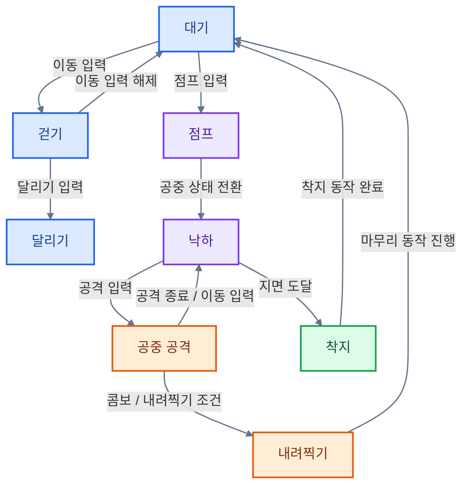
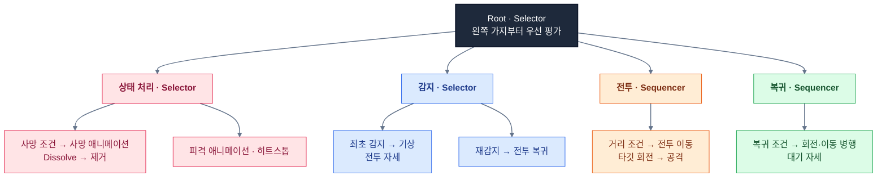
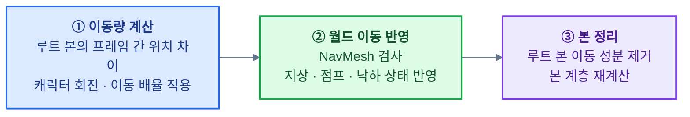
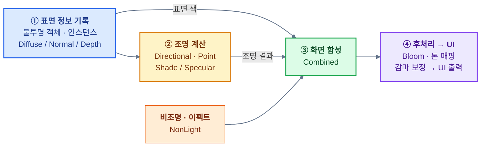

# 명조 모작 — C++ · DirectX 11 개인 프로젝트


오픈월드 액션 RPG **명조: 워더링 웨이브(Wuthering Waves)**의 캐릭터 전투와 보스전을 **C++와 DirectX 11로 모작한 개인 프로젝트**입니다.
**컴포넌트 기반 게임 프레임워크**부터 **플레이어 조작·전투**, **몬스터·보스 AI**, **애니메이션·렌더링**, **맵·상호작용·UI**와 **제작 도구**까지 구현했습니다.

## [GitHub Repository](https://github.com/Nu-LungJi/Direct3D-Personal-Project)
## [게임 시연 영상 (Demo Video)](https://youtu.be/_2EzDroSFFE)

| 항목      | 내용                                                                                                     |
| ------- | ------------------------------------------------------------------------------------------------------ |
| 개발 기간   | 2026.03.16 ~ 2026.06.26 (14주)                                                                          |
| 개발 인원   | 1인 — 전체 프로그래밍 담당                                                                                       |
| 플랫폼     | Windows PC / x64                                                                                       |
| 프로젝트 구성 | 공통 기능의 `Engine.dll` + 게임 로직의 `Client.exe`                                                              |
| 플레이 구성  | 플레이어 액션 전투 · 일반 몬스터 2종 · 최종 보스전                                                                        |
| 사용 기술   | C++17 · Direct3D 11(API) · HLSL · Assimp(FBX Load) · FlatBuffers(직렬화) · FMOD(Sound) · Dear ImGui(Tool) |
| 제작 보조   | Git/GitHub(협업), PhotoShop(리소스 편집), RenderDoc(디버깅), Google Gemini(AI)                                   |

## 주요 기술 구현

| 번호     | 기술                                   | 핵심 구현                                                       |
| ------ | ------------------------------------ | ----------------------------------------------------------- |
| **1**  | **컴포넌트 기반 프레임워크**                    | Scene·Layer·GameObject·Component 구성, Prototype 복제, 객체·자원 관리 |
| **2**  | **플레이어 FSM**                         | 13개 상태 분리, 지상·공중 콤보, 입력·애니메이션에 따른 상태 전환                     |
| **3**  | **몬스터·보스 BehaviorTtree와 Blackboard** | 조건·행동 노드 조합, 행동 우선순위, 공유 데이터와 보스 그로기 처리                     |
| **4**  | **애니메이션 · 블렌딩 · 루트 모션**              | 포즈 블렌딩, GPU 스키닝, NavMesh와 연동한 루트 본 이동 반영                    |
| **5**  | **Deferred Rendering**               | MRT 표면 정보 기록, 조명 누적·화면 합성, Toon·MatCap·Rim Light            |
| **6**  | **Post Process**                     | 밝은 영역 추출·블러·Bloom 합성, ACES 톤 매핑·감마 보정                       |
| **7**  | **에셋·맵 데이터 처리**                      | Assimp 임포트, FlatBuffers 바이너리 복원, 텍스처 캐시·맵 저장                |
| **8**  | **렌더링·객체 최적화**                       | 오브젝트·서브메시 컬링, GPU Instancing, HitBoxPool                    |
| **9**  | **NavMesh·충돌·전투 판정**                 | 이동 영역·지면 높이 검사, AABB·OBB, 시간에 따른 히트박스 제어                    |
| **10** | **이펙트·카메라·UI**                       | 공격 이펙트, 추적·액션 카메라, 쿨타임·보스 체력·상호작용 표시                        |
| **11** | **맵·내비게이션 제작 도구**                    | 레이 피킹, Transform 기즈모, 객체 배치·셀 편집·저장                         |

### 1. 컴포넌트 기반 프레임워크와 Prototype

공통 기능을 제공하는 **Engine**과 게임의 캐릭터·AI·장면을 구성하는 **Client**를 분리했습니다. Scene은 장면을, Layer는 장면 안의 객체 그룹을 관리하며, GameObject는 필요한 Component를 조합하여 기능을 구성합니다.

- **수명주기 분리:** `Priority_Update`, `Update`, `Late_Update`, `Render`로 입력·행동·후속 갱신·출력을 구분했습니다.
- **Prototype 패턴:** GameObject/Component 원형을 `ProtoManager`에 등록하고 `Clone()`으로 인스턴스를 생성합니다. 공통 생성 경로를 사용하면서 각 객체의 Transform과 게임 상태를 초기화합니다.
- **자원 공유:** 모델의 메시·텍스처 등 공유 가능한 자원과 객체별 상태를 구분하고, `TextureManager`에서 이미 로드한 텍스처를 캐싱하여 재사용합니다.
- **렌더 그룹:** 객체가 용도에 맞는 그룹에 등록되면 `RenderManager`가 불투명·블렌딩·이펙트·UI 등의 출력 순서를 관리합니다.
- **충돌 이벤트:** `CollisionManager`가 활성 콜라이더의 교차 여부와 이전 충돌 관계를 비교하고 `On_CollisionEnter/Stay/Exit` 콜백을 호출합니다.

관련 코드: [GameObject](https://github.com/Nu-LungJi/Direct3D-Personal-Project/blob/Master/Engine/Public/GameObject.h) · [ProtoManager](https://github.com/Nu-LungJi/Direct3D-Personal-Project/blob/Master/Engine/Private/ProtoManager.cpp)

### 2. 플레이어 FSM — 상태별 액션과 전환 제어

플레이어 행동을 **13개의 상태 클래스**로 분리했습니다. 공통 `State` 인터페이스를 상속하고, `StateMachine`은 초기화 시 모든 상태를 등록하고, 갱신 시 현재·이전 상태를 관리합니다.

| 상태 구분 | 상태 | 주요 역할 |
| --- | --- | --- |
| 기본 이동 | `IDLE`, `WALK`, `RUNNING` | 대기·걷기·달리기, 카메라 기준 이동과 방향 전환 |
| 회피 | `DASH` | 대시 애니메이션과 이동 처리 |
| 지상 전투 | `ATTACK`, `BOOST`, `SKILL`, `ULTIMATE` | 콤보·강화 공격·스킬·궁극기 및 이펙트·카메라 연동 |
| 공중 이동 | `JUMP`, `FALLING`, `LAND` | 점프·낙하·지면 판정·착지 전환 |
| 공중 전투 | `AIRATTACK`, `SLAM` | 공중 콤보와 내려찍기의 시작·낙하·마무리 처리 |

각 상태는 다음의 세 함수를 통해 행동을 제어합니다.

| 함수 | 처리 내용 |
| --- | --- |
| `FSM_StateEnter()` | 상태에 필요한 컴포넌트 참조, 애니메이션 선택, 진입 시 변수 초기화 |
| `FSM_StateUpdate(dt)` | 입력·애니메이션 진행률·지형 조건 검사, 이동·공격·연출 갱신 |
| `FSM_StateExit()` | 상태별 타이머·이펙트 실행 플래그 등 종료 처리 |

`FSM_StateChange()`는 **기존 상태 Exit → 다음 상태 선택 → 다음 상태 Enter** 순서로 실행합니다. 플레이어의 `Update()`에서 현재 상태를 갱신하고, 입력과 상태별 조건에 따라 다음 행동으로 전환합니다.

아래는 대표적인 이동·공중 전투 흐름입니다. 전체 상태 전이 중 핵심 경로를 요약했습니다.



이동은 카메라의 수평 전방·우측 벡터를 조합하여 계산하고, 목표 회전으로 **Quaternion Slerp**를 적용합니다. 공격 상태에서는 콤보 번호와 애니메이션 진행률을 기준으로 다음 공격·이펙트 실행 시점을 구분합니다. 같은 조건이 여러 프레임 유지되더라도 실행 플래그로 연출의 중복 생성을 제어합니다.

플레이어처럼 입력에 즉시 반응하고 현재 행동을 명확히 구분해야 하는 대상에 FSM을 적용하여, 상태별 이동·애니메이션·전투 처리를 분리했습니다.

관련 코드: [State 인터페이스](https://github.com/Nu-LungJi/Direct3D-Personal-Project/blob/Master/Client/Public/StateMachine.h) · [StateMachine](https://github.com/Nu-LungJi/Direct3D-Personal-Project/blob/Master/Client/Private/StateMachine.cpp) · [Player](https://github.com/Nu-LungJi/Direct3D-Personal-Project/blob/Master/Client/Private/Player.cpp)

### 3. Behavior Tree와 Blackboard — 일반 몬스터·보스 AI

몬스터는 **조건 검사와 행동 실행을 트리로 조합**합니다. 공통 노드와 **Blackboard**는 `Client/Default/Common.h`에 있으며, Monster_Knight/Monster_Void/최종보스가 각각 자신의 트리를 구성합니다.

모든 노드는 `SUCCESS`, `FAILURE`, `RUNNING` 중 하나를 반환합니다. 상위 노드는 이 결과를 이용하여 다음 자식을 실행할지, 현재 행동을 유지할지 결정합니다.

| 노드 | 평가 방식 | 사용 예 |
| --- | --- | --- |
| **Selector** | 왼쪽부터 검사하고 Failure가 아닌 첫 결과 반환 | 사망·피격을 전투보다 먼저 처리 |
| **Sequencer** | 자식을 순서대로 실행하며 Success가 아닌 결과에서 중단 | 사망 조건 → 사망 애니메이션 → 소멸 → 제거 |
| **Parallel (`Paralle`)** | 한 번의 갱신에서 여러 자식을 평가하고 결과 종합 | 원래 위치를 향한 회전과 이동 |
| **Condition / Action** | 조건 판단과 실제 행동을 별도 노드로 분리 | 거리·체력 검사 / 애니메이션·이동 실행 |
| **Inverter** | Success·Failure 반전, Running 유지 | 감지 범위 밖인지 검사 |
| **AlwaysSuccess / Failure** | 고정 결과를 반환하여 상위 흐름 제어 | 처리 후 다음 우선순위 가지로 진행 |

Parallel Node는 동일한 갱신 안에서 여러 행동을 평가하는 방식입니다. Selector Node와 Sequencer Node는 매 갱신마다 앞쪽 자식부터 검사하며, 행동의 진행 상황은 노드 변수·Blackboard·애니메이션 상태로 유지합니다.

일반 몬스터의 대표 트리는 다음과 같습니다.



**Blackboard**는 `unordered_map<string, std::any>`로 구성했습니다. `Set_Value<T>()`, `Get_Value<T>()`를 통해 소유자의 Transform·Animator, 플레이어 Transform, 초기 위치, 전투 자세와 행동 완료 여부를 공유합니다. 각 노드가 다른 노드의 구체 클래스에 접근하지 않고 공통 데이터를 조회하도록 구성했습니다.

최종 보스는 같은 노드 기반 위에 **사망·그로기·피격 처리 → 타깃 회전 → 공격 이펙트 → 공격 선택·재생** 순서의 가지를 배치했습니다. 공격 애니메이션의 진행률에 따라 공중 상태와 연출을 전환하며, 피격 시 히트스톱과 그로기 동작을 연결합니다.

플레이어는 현재 입력에 따른 상태 전환을 **FSM**으로 관리하고, AI는 여러 조건과 행동의 우선순위를 **BehaviorTree**로 구성하여 대상에 맞는 제어 방식을 적용했습니다.

관련 코드: [공통 노드·Blackboard](https://github.com/Nu-LungJi/Direct3D-Personal-Project/blob/Master/Client/Default/Common.h) · [기사 트리 구성](https://github.com/Nu-LungJi/Direct3D-Personal-Project/blob/Master/Client/Private/Monster_Knight.cpp) · [보스 트리 구성](https://github.com/Nu-LungJi/Direct3D-Personal-Project/blob/Master/Client/Private/Monster_FinalBoss.cpp) · [보스 행동 노드](https://github.com/Nu-LungJi/Direct3D-Personal-Project/blob/Master/Client/Private/BehaviorTree_FinalBoss.cpp)

### 4. 애니메이션 블렌딩·GPU 스키닝·루트 모션

애니메이션은 **키프레임에서 본 포즈 계산 → 본 계층 갱신 → 루트 모션 반영 → 스키닝 행렬 전달 → GPU 정점 변형**으로 처리합니다. 모델 로더가 본·채널·애니메이션 데이터를 구성하고 `Animator`가 재생 상태와 전환을 관리합니다.

**애니메이션 블렌딩**

이전 애니메이션과 현재 애니메이션의 Bone별 Transform을 구하고, 전환 시간에 따른 가중치로 두 포즈를 섞습니다. 기본 블렌딩 시간을 거치게 하여 자연스러운 애니메이션 전환을 구현했습니다.

```text
BlendWeight = min(전환 경과 시간 / 블렌딩 시간, 1)
위치·크기  = Lerp(이전 포즈, 현재 포즈, BlendWeight)
회전       = Quaternion Slerp(이전 회전, 현재 회전, BlendWeight)
본 행렬    = Scale × Rotation × Translation
```

- 두 회전 쿼터니언의 내적이 음수이면 현재 쿼터니언의 부호를 뒤집어 보간 방향을 맞춥니다.
- 이전 애니메이션의 재생 시점은 유지하고, 재생 중인 새 애니메이션으로 전환합니다.
- 루트 본의 위치는 현재 포즈 값을 사용하여 이동량 계산과 일반 본 위치 보간을 구분합니다.
- 전환이 끝나면 블렌딩 상태를 해제하고 이전 애니메이션의 재생 상태를 초기화합니다.

**GPU 스키닝**

CPU에서 계산한 본 행렬을 `g_BoneMatrices`로 전달합니다. 버텍스 셰이더는 정점의 본 인덱스와 최대 4개 가중치로 행렬을 가중합하고, 이를 정점 위치와 노멀에 적용합니다. 이후 World·View·Projection 변환을 수행합니다. 애니메이션 포즈 계산은 CPU가, 정점 변형은 GPU가 담당합니다.

**루트 모션과 NavMesh 연동**

애니메이션의 루트 본에서 프레임 간 이동량을 추출하고, 캐릭터가 바라보는 방향과 이동 배율을 적용하여 실제 월드 이동으로 변환합니다.



지상에서는 NavMesh 높이에 맞추고, 점프·낙하에서는 애니메이션 이동과 공중 상태를 반영합니다. 낙하 중 지면에 가까워지면 착지 상태로 전환합니다. 애니메이션을 바꾼 첫 프레임에는 이전 루트 위치를 현재 값으로 맞춰 클립 교체 순간의 불연속 이동을 줄입니다.

월드 위치를 갱신한 뒤 루트 본의 이동 성분을 제거하여 **본 이동과 객체 이동이 중복 적용되는 현상**을 방지했습니다.

관련 코드: [Animator](https://github.com/Nu-LungJi/Direct3D-Personal-Project/blob/Master/Engine/Private/Animator.cpp) · [Animation](https://github.com/Nu-LungJi/Direct3D-Personal-Project/blob/Master/Engine/Private/Animation.cpp) · [스키닝·캐릭터 셰이더](https://github.com/Nu-LungJi/Direct3D-Personal-Project/blob/Master/Shader_VtxAnimMesh.hlsl)

### 5. Deferred Rendering — MRT와 조명·합성 패스

불투명 객체의 표면 정보를 여러 렌더 타깃에 기록한 뒤, 별도 화면 패스에서 조명을 계산하고 최종 색을 합성하는 **디퍼드 렌더링 구조**를 구성했습니다. `RenderTargetManager`는 렌더 타깃·SRV·MRT 그룹을 관리하고, `RenderManager`는 패스 실행 순서와 셰이더 입력을 연결합니다.

| 버퍼                   | 저장 정보와 사용 목적                              |
| -------------------- | ----------------------------------------- |
| **Diffuse**          | 표면 색. 캐릭터는 Toon·MatCap·발광 등의 표현을 반영한 색 기록 |
| **Normal**           | 표면 방향을 기록하고 조명 패스에서 참조하는 입력               |
| **Depth**            | 투영 깊이와 위치 복원에 사용하는 정보                     |
| **Shade / Specular** | 조명 패스의 음영·반사광 누적 결과                       |
| **NonLight**         | 이펙트 등 별도 비조명 합성에 사용할 색                    |
| **Combined**         | 표면 색·조명·비조명 요소를 합성한 후처리 입력                |



조명 패스에 역투영·역뷰 행렬을 전달하여 화면 UV와 Depth 정보에서 위치를 복원하고, 광원의 방향·위치에 따른 조명 계산에 사용합니다. 조명과 표면 데이터는 다음 형태로 합성합니다.

```text
Combined = Diffuse × Shade + Specular + NonLight
```

캐릭터 재질에는 별도 표현을 적용했습니다.

- **Toon Shading :** 광원과 노멀의 내적을 `smoothstep`으로 조절하여 명암 경계와 밝기를 구성합니다.
- **MatCap :** 뷰 공간 노멀을 UV로 변환해 MatCap 텍스처를 조회하고 기본 색과 혼합합니다.
- **Rim Light :** 시선과 노멀의 관계로 가장자리 강조 색을 계산합니다.
- **Normal Mapping :** 탄젠트·바이노멀·노멀로 구성한 TBN을 통해 텍스처 노멀을 변환합니다.
- **Emissive / Dissolve :** 발광 색을 더하고, 소멸 시 NoiseThreshold와 `clip()`으로 픽셀 제거·경계 발광을 처리합니다.

현재 조명 셰이더는 읽은 노멀을 고정 방향으로 대체하는 조정이 포함되어 있습니다. 따라서 본 항목은 **MRT·조명 누적·화면 합성 구조와 스타일화된 재질 표현**을 중심으로 설명합니다.

관련 코드: [RenderManager](https://github.com/Nu-LungJi/Direct3D-Personal-Project/blob/Master/Engine/Private/RenderManager.cpp) · [RenderTargetManager](https://github.com/Nu-LungJi/Direct3D-Personal-Project/blob/Master/Engine/Private/RenderTargetManager.cpp) · [Deferred Shader](https://github.com/Nu-LungJi/Direct3D-Personal-Project/blob/Master/Shader_Deferred.hlsl)

### 6. 후처리 — Bloom·ACES 톤 매핑·감마 보정

합성 화면에서 밝은 영역을 추출하고 주변으로 퍼뜨린 후 원본에 더하여 발광을 강조했습니다. 밝은 색의 추출은 RGB의 휘도를 기준으로 합니다.

```text
Luminance = dot(Color, (0.2126, 0.7152, 0.0722))
BrightColor = 임계값 이상이면 Color, 미만이면 0
FinalColor = WorldColor + BloomColor × BloomIntensity
```

| 단계 | 처리 내용 |
| --- | --- |
| **Bright Pass** | Combined 텍스처에서 휘도 임계값 이상의 색 추출 |
| **Blur** | 중심과 양쪽 이웃 텍셀을 가중합하여 밝은 영역 확산 |
| **Bloom Composite** | 블러 결과를 강도 계수와 함께 장면 색에 가산 |
| **Tone Mapping** | ACES 근사 곡선으로 높은 밝기 범위를 화면 출력 범위에 압축 |
| **Gamma Correction** | `pow(color, 1 / 2.2)`로 최종 색 보정 |

Bright Pass와 블러 타깃의 가로·세로 크기를 화면의 **1/2**로 설정하여 후처리 대상 픽셀 수를 전체 화면의 **1/4**로 줄였습니다. 기본 Bloom 강도는 0.5이며, 발광 재질과 공격 이펙트가 후처리 결과에 함께 반영됩니다. UI는 후처리 이후 출력합니다.

렌더 매니저에는 가로·세로 블러 단계가 분리되어 있으나, 현재 두 단계가 사용하는 블러 셰이더는 세로 샘플 오프셋과 동일 입력을 참조합니다. **2축 분리 블러의 입력·오프셋 연결은 조정이 필요한 상태**이며, 밝은 영역 추출·블러 합성·ACES 근사·감마 보정 흐름이 구현되어 있습니다.

관련 코드: [RenderManager](https://github.com/Nu-LungJi/Direct3D-Personal-Project/blob/Master/Engine/Private/RenderManager.cpp) · [RenderTargetManager](https://github.com/Nu-LungJi/Direct3D-Personal-Project/blob/Master/Engine/Private/RenderTargetManager.cpp) · [Deferred Shader](https://github.com/Nu-LungJi/Direct3D-Personal-Project/blob/Master/Shader_Deferred.hlsl)

### 7. 에셋 처리 — Assimp 임포트와 FlatBuffers 바이너리 변환

모델 로딩은 **기존 바이너리 확인 → 바이너리 복원 또는 FBX 임포트 → 엔진 데이터 구성**으로 처리합니다. FBX를 매번 해석하는 대신, 최초 변환 결과를 이후 로딩에 활용하도록 구성했습니다.

**모델 임포트**에서는 DirectX 좌표계 변환, 스케일 조정, 메시 최적화와 캐시 지역성 개선 옵션을 적용합니다. 노드 계층을 순회하며 메시·본 관계를 구성하고, 애니메이션 채널과 키프레임을 엔진의 재생 데이터로 변환합니다.

**FlatBuffers 직렬화**에는 정적·동적 메시, 본, 채널, 애니메이션·Animator 등 모델을 복원하는 데 필요한 데이터가 포함됩니다. 로딩 시 해당 바이너리를 우선 조회하여 반복적인 원본 FBX 파싱을 줄입니다.

**텍스처 처리**에서는 같은 경로의 DDS 대체 파일이 있으면 DDS 로더를 사용하고, 그 외에는 WIC 로더를 사용합니다. 이미 로드된 텍스처의 SRV는 `TextureManager` 캐시에서 재사용합니다.

**맵 데이터**는 객체의 에셋 경로·태그·위치·회전·크기를 저장합니다. 로드 시 Prototype을 복제하고 저장된 Transform을 적용한 뒤 Scene·Layer에 등록하므로, 배치 결과를 게임 장면으로 복원할 수 있습니다. 내비게이션 셀은 별도 바이너리에 삼각형 정점과 셀 종류를 저장합니다.

관련 코드: [MeshLoader](https://github.com/Nu-LungJi/Direct3D-Personal-Project/blob/Master/Engine/Private/MeshLoader.cpp) · [TextureManager](https://github.com/Nu-LungJi/Direct3D-Personal-Project/blob/Master/Engine/Private/TextureManager.cpp) · [MapEditor](https://github.com/Nu-LungJi/Direct3D-Personal-Project/blob/Master/Engine/Private/MapEditor.cpp)

### 8. 최적화 — Frustum Culling·GPU Instancing·Object Pool

**오브젝트·서브메시 단위 Frustum Culling**

투영 행렬로 프러스텀을 생성하고 역뷰 행렬로 월드 공간에 변환합니다. AABB를 가진 대상은 오브젝트 단위로 먼저 검사하고, 화면에 걸치는 객체의 서브메시도 개별 바운딩 박스로 검사합니다.

서브메시별 결과를 Render Flag에 기록하고, 렌더 등록·인스턴스 수집 단계에서 제외합니다. 컬링 대상은 주로 맵의 AABB 기반 객체이며, 콜라이더가 없거나 OBB를 사용하는 객체는 해당 검사 경로를 건너뜁니다.

**공유 인스턴스 버퍼를 사용하는 GPU Instancing**

동일 `InstanceMesh`를 참조하는 맵 객체를 묶고, 각 객체의 월드 행렬을 하나의 그룹에 모읍니다.

1. 컬링을 통과한 서브메시의 월드 행렬을 수집합니다.
2. 전역 Dynamic Instance Buffer를 `D3D11_MAP_WRITE_DISCARD`로 매핑합니다.
3. 각 그룹의 행렬을 연속으로 기록하고 그룹별 시작 오프셋을 저장합니다.
4. 대표 메시·셰이더·텍스처와 해당 인스턴스 버퍼 구간을 바인딩합니다.
5. `DrawIndexedInstanced()`로 그룹을 출력하고 프레임의 행렬 목록을 비웁니다.

같은 서브메시의 반복 배치를 그룹 단위로 제출하여 개별 드로우 호출을 줄입니다. **컬링이 그릴 대상을 줄이고, 인스턴싱이 남은 반복 객체의 제출 횟수를 줄이는 방식**으로 연결했습니다.

**히트박스 Object Pool과 자원 재사용**

`HitBoxPool`이 히트박스를 미리 생성하고 비활성 객체를 찾아 공격에 사용합니다. 공격 종료 시 시간·크기·피해 기록을 초기화하고 비활성화하여 다음 공격에서 재사용합니다. 텍스처 캐시와 Prototype·메시 공유 역시 반복적인 로딩·생성 비용을 줄이는 데 사용했습니다.

| 적용 기법 | 줄이는 작업 |
| --- | --- |
| Frustum Culling | 시야 밖 오브젝트·서브메시의 렌더 처리 |
| GPU Instancing | 동일 서브메시 반복 배치의 드로우 제출 |
| HitBox Pool | 공격마다 히트박스를 생성·파괴하는 작업 |
| Binary Asset Cache | 반복적인 FBX 파싱과 데이터 변환 |
| Texture Cache | 동일 텍스처의 반복 로딩 |
| 저해상도 후처리 | Bright Pass·Blur의 처리 픽셀 수 |

관련 코드: [InstanceMesh](https://github.com/Nu-LungJi/Direct3D-Personal-Project/blob/Master/Engine/Private/InstanceMesh.cpp) · [PlayerCamera](https://github.com/Nu-LungJi/Direct3D-Personal-Project/blob/Master/Client/Private/PlayerCamera.cpp)

### 9. NavMesh·충돌·시간 기반 전투 판정

삼각형 NavMesh에서 이동 예정 위치의 XZ 좌표가 포함되는 셀을 찾고, 그 셀의 높이와 캐릭터의 현재 높이를 비교합니다. 수평·수직·차단 셀의 종류에 따라 이동을 제한하며, 지상 이동 시 높이를 보간하여 단차 변화에 대응합니다. **이동 가능 영역과 지면 높이 판정**을 루트 모션·점프·낙하 처리에 연결했습니다.

충돌에는 AABB·OBB를 사용하고, 현재·이전 교차 상태를 비교하여 Enter·Stay·Exit 이벤트를 전달합니다. 공격은 애니메이션 진행률과 타이머에 맞춰 히트박스를 활성화합니다.

| 히트박스 설정 | 역할 |
| --- | --- |
| 위치·회전 | 캐릭터 방향을 기준으로 타격 영역 배치 |
| 시작·종료 크기 | 공격의 확장·진행 범위 구성 |
| 등장 지연·지속·후속 시간 | 준비 동작과 판정 발생·종료 시점 분리 |
| Lerp·Smoothstep·Ease-out | 시간에 따른 판정 영역 변화 |
| 피해량·피해 표시 지연 | 피격 처리와 피해 수치 연출 타이밍 조절 |

콤보에 따라 여러 히트박스를 시간차로 생성하여 다단 공격과 방향별 타격 범위를 구성합니다. 피격 시에는 `TimeManager`의 시간 배율을 일시적으로 낮추는 히트스톱과 카메라 셰이크를 조합합니다.

관련 코드: [HitBoxPool](https://github.com/Nu-LungJi/Direct3D-Personal-Project/blob/Master/Client/Private/HitBoxPool.cpp) · [PlayerHitBox](https://github.com/Nu-LungJi/Direct3D-Personal-Project/blob/Master/Client/Private/PlayerHitBox.cpp) · [NavMeshAgent](https://github.com/Nu-LungJi/Direct3D-Personal-Project/blob/Master/Engine/Private/NavMeshAgent.cpp) · [CollisionManager](https://github.com/Nu-LungJi/Direct3D-Personal-Project/blob/Master/Engine/Private/CollisionManager.cpp)

### 10. 이펙트·카메라·UI 연동

공격 이펙트는 텍스처와 메시를 조합하고, **UV 스크롤·노이즈 왜곡·Dissolve·페이드**를 셰이더 파라미터로 조절합니다. 상태별 애니메이션 진행률에서 이펙트를 생성하고 위치·회전·크기·수명·스크롤 속도를 지정합니다. Effekseer 효과 재생과 FMOD 사운드를 함께 연동했습니다.

- **플레이어 카메라:** 캐릭터 본 위치를 참조한 추적, 마우스 회전, 거리 보간, 셰이크·드롭 연출
- **액션 카메라:** 궁극기·보스 공격의 진행에 맞춘 별도 카메라 동작과 시점 전환
- **메인 UI:** 스킬 아이콘·쿨타임, 방향 표시와 화면 필터 갱신
- **보스·전투 UI:** 보스 체력바·타이틀, 피해 수치와 피격 연출 연결
- **상호작용 UI:** 팝업·이벤트 UI, 포탈·보상 상자 등의 게임 객체 연동

물 표현에는 별도 렌더 타깃에 하늘을 그린 반사 텍스처, Fresnel 혼합, Foam 텍스처의 UV 스크롤과 왜곡을 사용했습니다.

관련 코드: [PlayerEffect](https://github.com/Nu-LungJi/Direct3D-Personal-Project/blob/Master/Client/Private/PlayerEffect.cpp) · [Effect Shader](https://github.com/Nu-LungJi/Direct3D-Personal-Project/blob/Master/Shader_Effect.hlsl) · [ActionCamera](https://github.com/Nu-LungJi/Direct3D-Personal-Project/blob/Master/Client/Private/ActionCamera.cpp)

### 11. 맵·내비게이션 제작 도구

Dear ImGui와 ImGuizmo를 엔진에 연결하여 실행 중 객체를 선택하고 배치를 조절하는 도구를 구성했습니다.

- **Ray Picking:** 화면 입력에서 레이를 구성해 객체·메시 삼각형을 선택합니다.
- **Transform 기즈모:** 이동·회전·크기 변경과 로컬·월드 축 조작을 지원합니다.
- **맵 편집:** 모델을 선택해 Prototype에서 배치 객체를 생성하고, 배치 결과를 바이너리로 저장·복원합니다.
- **내비게이션 편집:** 삼각형 셀 생성·삭제, 셀 유형 지정과 디버그 표시, 정점·셀 종류 저장 기능을 구성했습니다.
- **추가 편집 패널:** UI 위치·표현과 셰이더·이펙트 파라미터를 조절하는 패널을 구현했습니다. 현재 기본 GUI 호출은 메시 생성기와 Transform 도구를 중심으로 활성화되어 있습니다.

관련 코드: [MainUI](https://github.com/Nu-LungJi/Direct3D-Personal-Project/blob/Master/Client/Private/MainUI.cpp) · [BossUI](https://github.com/Nu-LungJi/Direct3D-Personal-Project/blob/Master/Client/Private/BossUI.cpp) · [GUIEditor](https://github.com/Nu-LungJi/Direct3D-Personal-Project/blob/Master/Engine/Private/GUIEditor.cpp) · [Navigator](https://github.com/Nu-LungJi/Direct3D-Personal-Project/blob/Master/Engine/Private/Navigator.cpp)

## 개발 환경

| 분류 | 기술 |
| --- | --- |
| 언어 | C++17 / STL |
| 그래픽 | Direct3D 11 / HLSL Shader Model 5.0 / Effects11 |
| 수학·그래픽 유틸리티 | DirectXMath / DirectXTK / DirectXTex |
| 모델·애니메이션 임포트 | Assimp |
| 데이터 직렬화 | FlatBuffers |
| 입력·오디오 | DirectInput 8 / FMOD |
| 이펙트 | 자체 HLSL 이펙트 / Effekseer·EffekseerRendererDX11 |
| 제작·디버그 도구 | Dear ImGui / ImGuizmo / Win32 API |
| 개발·버전 관리 | Visual Studio / MSVC / Windows SDK / Git·GitHub |

## 원작 및 리소스

원작은 KURO GAMES의 [명조: 워더링 웨이브(Wuthering Waves)](https://store.steampowered.com/app/3513350/Wuthering_Waves/?l=koreana)입니다. 본 프로젝트는 학습·포트폴리오용 모작이며, 원작 리소스와 외부 라이브러리의 권리는 각 권리자에게 있습니다.
